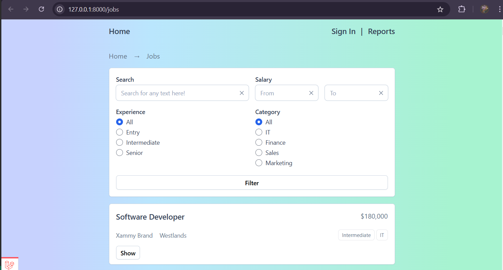
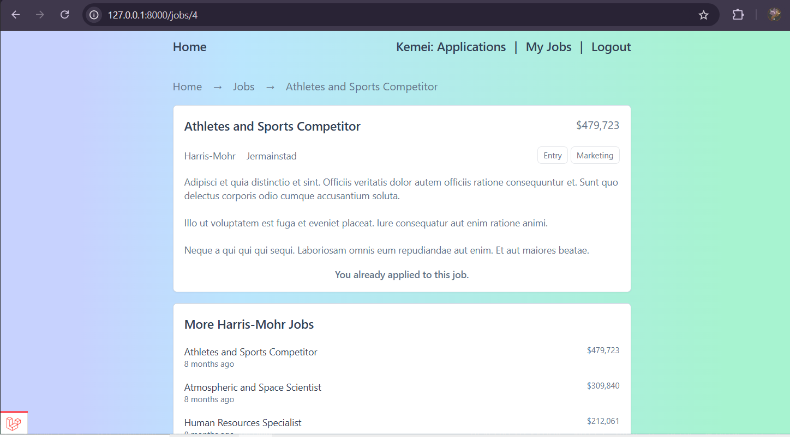

# Larajobs

Larajobs is a comprehensive job board application built with Laravel and Blade templates. It allows employers to post job opportunities and track applicants, while job seekers can create profiles, upload their resumes, and apply for jobs.

---

## Features
- **Job Listings**: Employers can post jobs and provide detailed descriptions.
- **Resume Uploads**: Job seekers can upload CVs as part of their application process.
- **Application Tracking**: Employers can view the number of applicants for each job posting.
- **User-Friendly Dashboard**: Seamless management of job postings and applications.

---

## Screenshot

****

****

Visual overview of Larajobs.

---

## Installation and Setup

Follow these steps to run Larajobs locally:

### Prerequisites
- PHP 8.1 or higher
- Composer
- MySQL database
- Git

### Steps

1. **Clone the Repository**
   ```bash
   git clone https://github.com/NjauSamuel/Job_Listing_Board.git
   cd larajobs
   ```

2. **Install Dependencies**
   ```bash
   composer install
   ```

3. **Environment Setup**
   Copy the `.env.example` file to create a `.env` file and configure your database credentials.
   ```bash
   cp .env.example .env
   ```
   Update the following lines in the `.env` file:
   ```env
   DB_DATABASE=your_database_name
   DB_USERNAME=your_database_user
   DB_PASSWORD=your_database_password
   ```

4. **Generate Application Key**
   ```bash
   php artisan key:generate
   ```

5. **Run Migrations and Seeders**
   ```bash
   php artisan migrate --seed
   ```

6. **Start the Development Server**
   ```bash
   php artisan serve
   ```
   Access the application at `http://localhost:8000`.

---

## Usage
- **For Employers**: Post job opportunities, track applicant numbers, and manage applications.
- **For Job Seekers**: Register, upload resumes, and apply to jobs seamlessly.

---

## Contributing
Contributions are welcome! Please fork the repository and submit a pull request with your improvements. 

**Author:** [Samuel Njau](https://www.linkedin.com/in/samuel-njau/)

---
